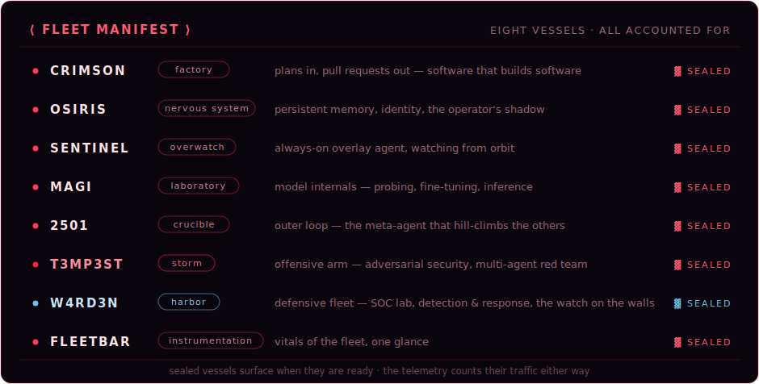

  <picture>
    <source media="(prefers-color-scheme: light)" srcset="assets/hero-light.svg">
    
  </picture>

  

  

 

 

**physician-engineer** · medicine × autonomous systems

<em>the horizon is the sky that contains the dawn</em>

